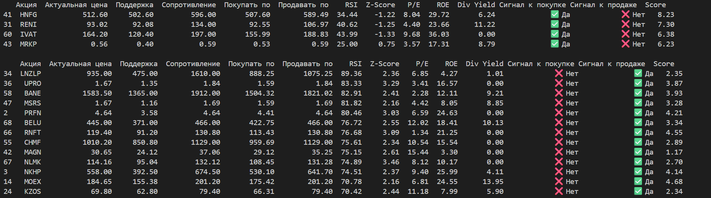

# Система анализа акций и формирования инвестиционных рекомендаций

Данный проект представляет собой автоматизированную систему для сбора рыночных
и фундаментальных данных по акциям, их анализа и генерации рекомендаций по покупке или продаже.
Проект использует API брокера «T-банк».

_Эта программа — инструмент анализа, а не советчик. То, что она предлагает, не означает, что нужно действовать. Инвестируйте осознанно!_

[Для использования этой программы вам потребуется счёт в Т-инвестициях и созданный токен](https://www.tbank.ru/invest/settings/api/)

---

## Структура проекта

* __main.py__ — основной скрипт для запуска
* __data.py__ — класс для получения данных с API T-банка
* __analysis.py__ — класс для анализа и рекомендаций
* __candles.csv__ — файл создаётся автоматически при использовании `data.py`
* __fundamentals.csv__ — файл создаётся автоматически при использовании `data.py`
* __stock_tracker.xlsx__ — файл нужно создать вручную:
    - первый лист «Recomendations» с указанием столбцов: Акция, Начальная цена, Сигнал, Дата рекомендации, Актуальная цена, Дата, Изменение (%)
    - второй лист «Trade_History» с указанием столбцов: Акция, Сигнал, Цена, Результат (%), Кол-во дней

---

## Библиотеки
- **Python 3.12+**
- `pandas`, `numpy` — обработка данных
- `scikit-learn` — нормализация (`minmax_scale`)
- `t_tech.invest` — клиент API для доступа к данным T-банка
- `openpyxl` — запись в Excel
- `datetime` — работа с датами

---

## Настройка

1. Создайте токен в Т-банке (никому не сообщайте токен и не храните на виду).
2. Клонируйте репозиторий, введите в консоль:
    * git clone https://github.com/ChtoGde/invest_analysis
    * cd invest_analysis
4. Создайте виртуально окружение:
    * python -m venv venv
    * venv\Scripts\activate
5. Установите необходимые библиотеки:
    * pip install -r requirements.txt
6. В файле _main.py_ в строке 13 где _my_client = MyClient(TOKEN)_ вставить свой токен в поле для токена.
7. Запустить код

---

## Логика сигналов

### Покупка:
Условия:
- Score >= 6
- RSI < 50
- P/E < 15
- ROE > 10

### Продажа:
Условия:
- RSI > 70
- Z-Score > 2

---

## Пример вывода

---

## Что можно улучшить?

1. Добавить анализ новостных и покупательских настроений вокруг акций, как одно из измерений
2. Реализовать модель машинного обучения, для автоматичесого определения весов фундаментальных показателей и более точных прогнозов.
